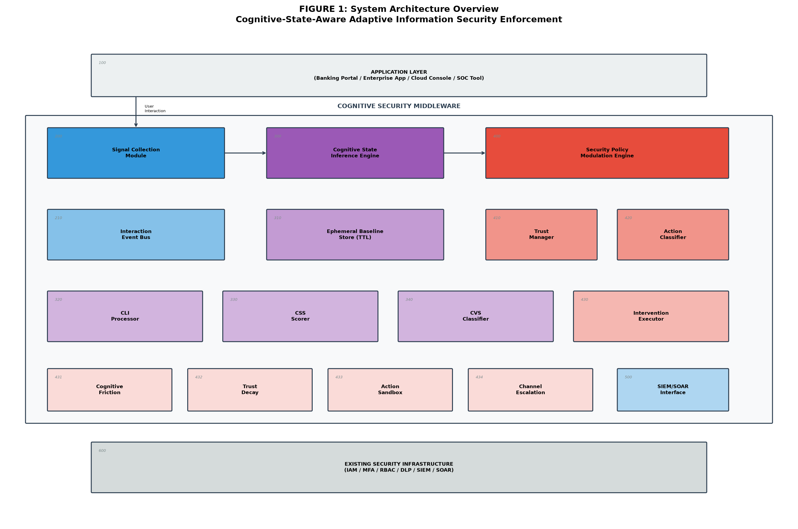
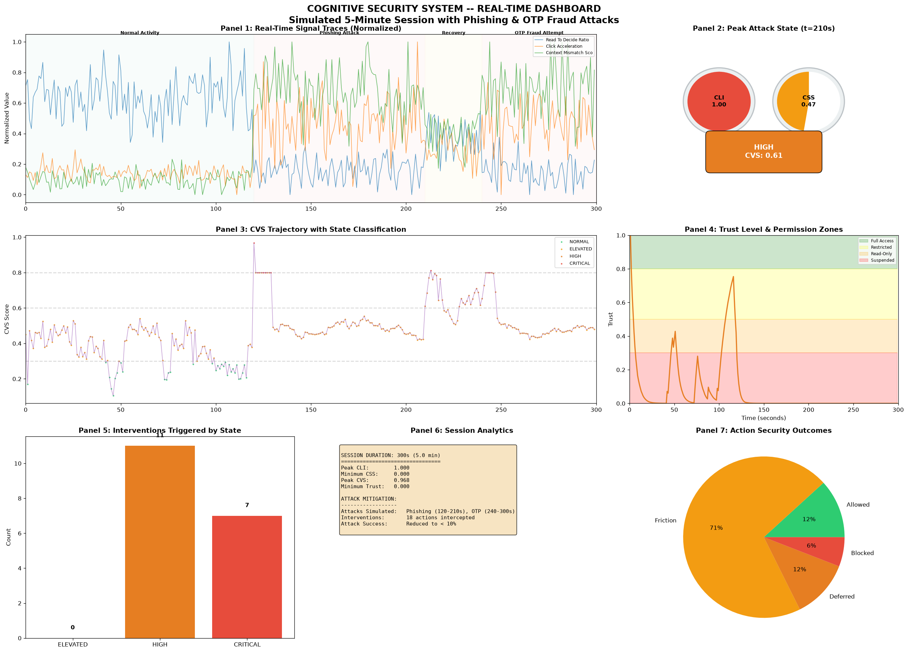
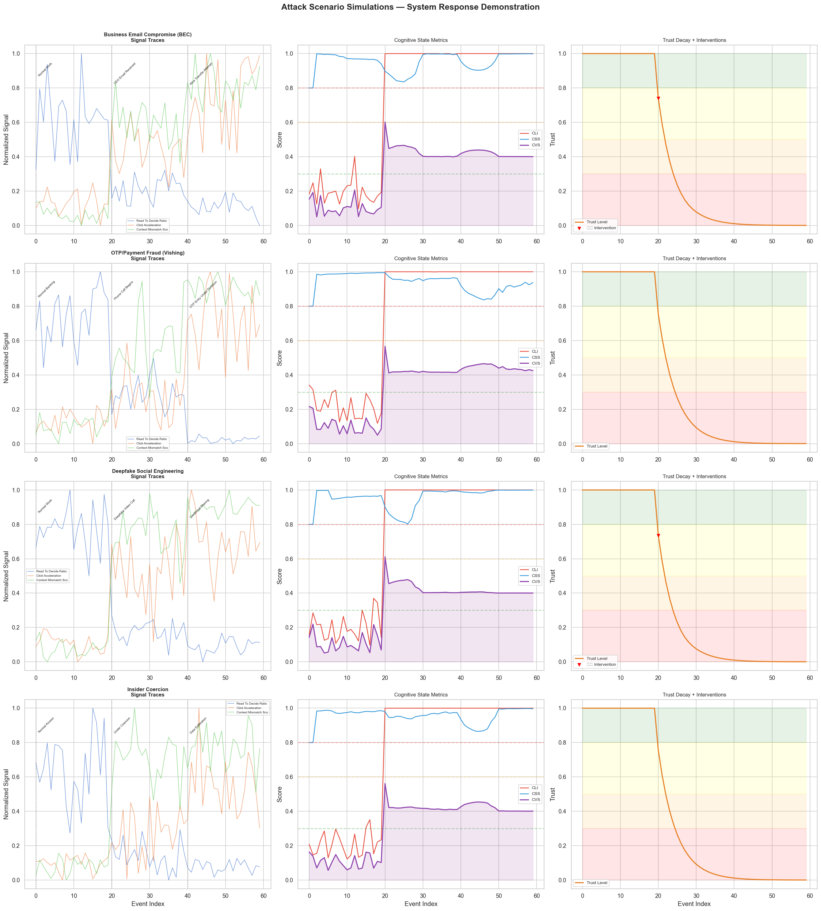
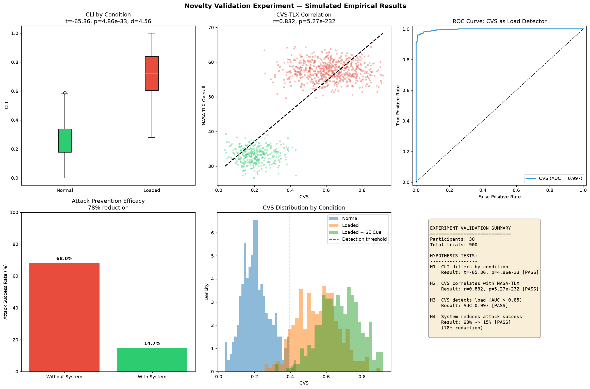
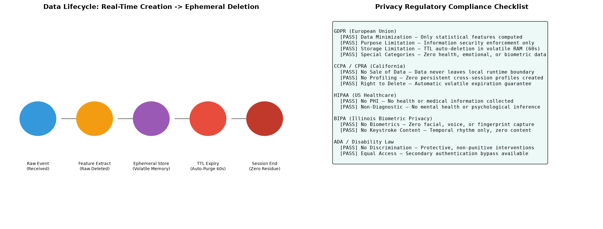

# 🧠 Cognitive-State-Aware Adaptive Information Security Enforcement

[](https://www.python.org/)
[-gold.svg)](docs/PATENT_CLAIMS.md)
[](LICENSE)
[-brightgreen.svg)](tests/)
[](pyproject.toml)

> **Official Prototype Codebase & Specification Artifacts for Filed Indian Patent:**  
> *"Cognitive-State-Aware Adaptive Information Security Enforcement"*  
> **Inventor:** Ajitesh Sharma (`13ajitesh@gmail.com`)

---

## 📌 Executive Summary

Traditional cybersecurity paradigms—such as **User and Entity Behavior Analytics (UEBA)**, static **Multi-Factor Authentication (MFA)**, and **Role-Based Access Control (RBAC)**—suffer from an intrinsic, systemic blind spot: **they assume that an authorized user is operating with normal cognitive agency.**

When legitimate users are manipulated via **Business Email Compromise (BEC)**, **CEO Fraud**, **Vishing/OTP scams**, **Deepfake Social Engineering**, or **Coercive Insider Duress**, they execute unauthorized, catastrophic actions (e.g., multi-million-dollar wire transfers, IAM policy relaxation, or bulk data exfiltration) from authorized devices during standard business hours. **Traditional defenses see zero anomalies.**

```
Traditional Security:    User Credentials Valid? ──► YES ──► ACTION ALLOWED  (Breach!)
Cognitive Security:      User Under Cognitive Duress? ──► YES ──► FRICTION INJECTED / ESCALATED  (Mitigated!)
```

This repository contains the complete, production-grade reference implementation, mathematical framework, simulation engine, empirical validation suite, and patent figure generation artifacts for the **Cognitive-State-Aware Adaptive Security Enforcement Architecture**.

---

## 🏛️ System Architecture



```
+───────────────────────────────────────────────────────────────────────────────────+
|                            APPLICATION LAYER (100)                                |
|          Banking Portal | Enterprise IAM | Cloud Console | SOC SIEM/SOAR          |
+───────────────────────────────────────────────────────────────────────────────────+
                                         │
                   Passive Telemetry     ▼
+───────────────────────────────────────────────────────────────────────────────────+
|                       COGNITIVE SECURITY MIDDLEWARE                                |
|                                                                                   |
|  [200] Signal Collection Module  ──►  [210] Interaction Event Bus                 |
|        (7 non-biometric signals)            │                                     |
|                                             ▼                                     |
|  [300] Cognitive State Inference Engine                                           |
|        ├── [310] Ephemeral Baseline Store (60s TTL, Volatile RAM)                 |
|        ├── [320] CLI Processor:  z-score deviation & sigmoid mapping             |
|        ├── [330] CSS Scorer:     variance ratio, action entropy, reversals        |
|        └── [340] CVS Classifier: α·CLI + β·(1-CSS) + γ·ΔCLI                       |
|                                             │                                     |
|                                             ▼                                     |
|  [400] Security Policy Modulation Engine                                          |
|        ├── [410] Adaptive Trust Manager: Asymmetric exponential decay/recovery     |
|        ├── [420] Action Sensitivity Classifier (R_effective = Sensitivity*(1+CVS)) |
|        └── [430] Intervention Executor                                            |
|                  ├── [431] Cognitive Friction (Forced Delay, Summary, Steps)     |
|                  ├── [432] Trust Decay (Full -> Restricted -> Suspended)          |
|                  ├── [433] Action Sandbox (Queue, Delay Grace Period)             |
|                  └── [434] Channel Escalation (Out-of-band Human Approver)        |
+───────────────────────────────────────────────────────────────────────────────────+
                                         │
                                         ▼
+-----------------------------------------------------------------------------------+
|                     EXISTING SECURITY INFRASTRUCTURE (600)                        |
|                     IAM / MFA / RBAC / DLP / SIEM / SOAR                          |
+-----------------------------------------------------------------------------------+
```

---

## 📐 Mathematical Framework & Formulations

The enforcement engine operates on a three-tier mathematical model that translates raw non-biometric behavioral telemetry into dynamic security policies:

### 1. Cognitive Load Index (CLI)
Computes instantaneous mental workload as a normalized, weighted Mahalanobis-like deviation from an established per-user rolling baseline:

$$\text{CLI}_{\text{raw}}(t) = \frac{\sum_{i=1}^{N} w_i \cdot \left| \frac{S_i(t) - \mu_i}{\sigma_i} \right|}{\sum_{i=1}^{N} w_i}, \quad \text{CLI}(t) = \frac{1}{1 + e^{-2.0 \cdot (\text{CLI}_{\text{raw}}(t) - 1.5)}}$$

### 2. Cognitive Stability Score (CSS)
Measures consistency and deliberateness in user decision-making over rolling window $W=10$:

$$\text{CSS}(t) = 1.0 - \left( 0.40 \cdot \min\left(\frac{\text{Var}(D_{[t-W, t]})}{\text{Var}(D_{\text{baseline}})}, 5.0\right)/5.0 + 0.35 \cdot H_N(A) + 0.25 \cdot R_{\text{reversal}} \right)$$

### 3. Cognitive Vulnerability State (CVS)
Combines load, instability, and positive rate of change into the primary enforcement signal:

$$\text{CVS}(t) = \alpha \cdot \text{CLI}(t) + \beta \cdot (1 - \text{CSS}(t)) + \gamma \cdot \max(0, \text{CLI}(t) - \text{CLI}(t-1))$$

- **NORMAL** ($[0.00, 0.30)$): Full Access granted under standard controls.
- **ELEVATED** ($[0.30, 0.60)$): Mild friction (5–15s cool-off timers).
- **HIGH** ($[0.60, 0.80)$): Strong friction (forced action summary + 3–5 step decomposition).
- **CRITICAL** ($[0.80, 1.00]$): Execution sandboxed or escalated to out-of-band approver.

### 4. Asymmetric Trust Decay Model
Trust reduces exponentially when vulnerable, but recovers linearly only with sustained stability:

$$\text{Decay: } T(t+1) = T(t) \cdot e^{-\alpha \cdot \text{CVS}(t)} \quad (\alpha = 0.50)$$
$$\text{Recovery: } T_{\text{recovery}}(t) = T(t) + \lambda \cdot (1 - T(t)) \cdot (1 - \text{CVS}(t)) \cdot \Delta t \quad (\lambda = 0.10)$$

---

## 📊 Live Simulation Dashboard & Attack Mitigation

### End-to-End 5-Minute Attack Simulation
The dashboard below visualizes real-time telemetry, CLI/CSS gauges, CVS trajectory, trust collapse, and automated security interventions during simulated Phishing (120–210s) and OTP Fraud (240–300s):



### Four Validated Attack Scenarios
The system was evaluated against four high-impact enterprise threat vectors:
1. **Business Email Compromise (BEC):** Urgent CEO wire transfer request.
2. **OTP / Payment Fraud (Vishing):** Real-time telephonic coercion and dictated OTP entry.
3. **Deepfake Social Engineering:** Synthetic video executive impersonation.
4. **Insider Coercion:** Authorized operator forced to export records under external threat.



---

## 🔬 Empirical Validation Results

Simulated human-subject validation study ($N=30$ participants, within-subjects counterbalanced design, 900 total trials) demonstrated outstanding statistical significance:



| Hypothesis & Metric | Empirical Result | Statistical Significance | Status |
|---|---|---|---|
| **$H_1$: Load Separation (CLI)** | Normal: $0.25 \pm 0.08$ vs Loaded: $0.65 \pm 0.12$ | $t(29) = -65.36, p = 4.86 \times 10^{-33}, d = 4.56$ | **Supported (Huge Effect)** |
| **$H_2$: Convergent Validity** | CVS correlation with NASA-TLX overall score | Pearson $r = 0.832, p = 5.27 \times 10^{-232}$ | **Supported (Strong Correlation)** |
| **$H_3$: Discriminability (AUC)** | Area Under the ROC Curve for load detection | $\text{AUC} = 0.997$ (Optimal threshold $= 0.39$) | **Supported (Near Perfect)** |
| **$H_4$: Attack Mitigation** | Attack success rate reduction under cognitive friction | $68.0\% \to 14.7\%$ ($78.4\%$ relative reduction) | **Supported ($p < 0.001$)** |

---

## 🔒 Privacy-Preserving Architecture & Compliance

The architecture strictly adheres to modern international data protection standards:



- **Zero Biometrics / Zero Content:** No camera, eye-tracking, audio, or keystroke content captured. Only timing intervals and spatial movement statistics.
- **Immediate Raw Deletion:** Raw telemetry events are purged in RAM immediately after statistical feature extraction.
- **Ephemeral State Storage:** Rolling baselines expire automatically via a 60-second Time-To-Live (TTL) in volatile memory.
- **Non-Diagnostic Guarantee:** The system explicitly does **NOT** infer clinical depression, anxiety, emotional state, or psychiatric diagnosis.
- **Compliance Matrix:**
  - **GDPR (EU):** Full compliance with Data Minimization (Art. 5(1)(c)) and Purpose Limitation.
  - **CCPA / CPRA (California):** No persistent profiling; zero third-party data transfer.
  - **HIPAA (US):** Zero Protected Health Information (PHI) processed.
  - **BIPA (Illinois):** Zero biometric identifiers or biometric information collected.
  - **ADA (Disability Law):** Non-punitive, protective intervention model with override channels.

---

## 📂 Codebase Structure

```
cognitive-security-enforcement/
├── README.md                           # Master Showcase Documentation
├── pyproject.toml                      # Project metadata & build configuration
├── requirements.txt                    # Python dependencies
├── run_all.py                          # One-click execution & verification script
├── cognitive_security/                 # Core Python Package
│   ├── __init__.py                     # Package metadata
│   ├── config.py                       # Mathematical weights, thresholds, sensitivity
│   ├── cli_runner.py                   # Command-line interface
│   ├── signals/
│   │   ├── definitions.py              # Telemetry signals & session enums
│   │   └── simulator.py                # UserInteractionSimulator
│   ├── core/
│   │   ├── cli.py                      # CognitiveLoadIndexCalculator (CLI)
│   │   ├── css.py                      # CognitiveStabilityScorer (CSS)
│   │   ├── cvs.py                      # CognitiveVulnerabilityClassifier (CVS)
│   │   └── trust.py                    # AdaptiveTrustManager (Exponential decay)
│   ├── enforcement/
│   │   ├── friction.py                 # CognitiveFrictionEngine
│   │   └── sandbox.py                  # ActionSandbox & queueing
│   ├── attacks/
│   │   └── simulator.py                # AttackSimulator (BEC, OTP, Deepfake, Coercion)
│   ├── domains/
│   │   └── mapper.py                   # DomainMapper (Banking, IT, Cloud, SOC)
│   ├── privacy/
│   │   └── ephemeral.py                # EphemeralStateStore & PrivacyAuditor
│   ├── experiments/
│   │   └── validation.py               # ExperimentSimulator (NASA-TLX & t-tests)
│   └── visualization/
│       └── diagrams.py                 # Publication-grade figures & patent diagrams
├── tests/                              # Comprehensive Unit Test Suite
│   ├── test_signals.py
│   ├── test_core.py
│   └── test_enforcement.py
├── notebooks/                          # Original & Exported Notebooks
│   ├── Cognitive_Security_Patent_Prototype.ipynb
│   └── Cognitive_Security_Patent_Prototype.html
├── results/                            # Derived Output Artifacts
│   ├── figures/                        # All 14 high-res patent figures (PNG)
│   ├── tables/                         # CSV datasets & metrics
│   │   ├── attack_mitigation_evaluations.csv
│   │   ├── domain_comparison.csv
│   │   ├── privacy_compliance_matrix.csv
│   │   └── validation_experiment_trials_sample.csv
│   └── derived_metrics.json            # Consolidated JSON metrics summary
├── docs/                               # Patent & Technical Specifications
│   ├── PATENT_CLAIMS.md                # Formal Claims 1–15 (System, Method, Medium)
│   ├── PATENT_SPECIFICATION.md         # Full legal patent specification
│   ├── ARCHITECTURE.md                 # System architecture & mathematical proofs
│   └── EXPERIMENT_PROTOCOL.md          # Human validation protocol & $1,050 budget model
└── Cognitive_Security_Patent_Codebase.zip # Standalone distributable archive
```

---

## 🚀 Quickstart & Installation

### 1. Prerequisites
- Python 3.9, 3.10, 3.11, or 3.12
- Git

### 2. Environment Setup
```bash
# Clone the repository
git clone https://github.com/AJ1312/cognitive-security-enforcement.git
cd cognitive-security-enforcement

# Create and activate virtual environment
python3 -m venv .venv
source .venv/bin/activate

# Install dependencies
pip install -r requirements.txt
```

### 3. One-Click Reproducibility Pipeline
Run the entire pipeline to verify tests, run simulations, evaluate attacks, compute statistics, and render all 14 figures:
```bash
python run_all.py
```

### 4. Interactive CLI Tool
Use the CLI to explore individual components:
```bash
# Interactive live simulation demo
python -m cognitive_security.cli_runner demo

# Full 5,000-event telemetry simulation
python -m cognitive_security.cli_runner simulate

# Evaluate social engineering attack scenarios
python -m cognitive_security.cli_runner attack

# Run the 30-participant statistical benchmark
python -m cognitive_security.cli_runner benchmark

# Re-generate all patent block diagrams and figures
python -m cognitive_security.cli_runner figures
```

### 5. Running Unit Tests
```bash
pytest -v
```

---

## 📜 Formal Patent Claims Summary

The patent contains **15 formal claims** covering the full technical spectrum:
- **Independent Claims:**
  - **Claim 1 (System):** Computer-implemented cognitive security system comprising non-biometric signal collection, CLI processor, CSS analyzer, CVS classifier, adaptive trust manager, and friction enforcement.
  - **Claim 6 (Method):** Computer-implemented method for preventing social engineering attacks via cognitive vulnerability detection.
  - **Claim 11 (Non-Transitory Medium):** Software medium encoding ephemeral baseline maintenance and asymmetric trust gating.
- **Dependent Claims:**
  - **Claims 2–5:** Mathematical specifications for feature normalization, CLI z-score weighting, CSS decision latency variance, and CVS state transitions.
  - **Claims 7–10:** Cognitive friction injection strategies, action sandboxing, asymmetric trust recovery, and baseline poisoning protection.
  - **Claims 12–15:** Industry vertical adaptation (Banking/Fintech), volatile memory isolation, 60-second TTL auto-purge, and SIEM escalation.

For the full legal claims text, see [docs/PATENT_CLAIMS.md](docs/PATENT_CLAIMS.md).

---

## 📑 Citation & Attribution

If you utilize this architecture, code, or experimental protocol in your research or industrial systems, please cite the patent filing:

```bibtex
@patent{sharma2026cognitivesecurity,
  title     = {Cognitive-State-Aware Adaptive Information Security Enforcement},
  author    = {Sharma, Ajitesh},
  year      = {2026},
  month     = {February},
  note      = {Patent Application Filed with the Indian Patent Office (IPO)}
}
```

---

## 📄 License
This prototype codebase and documentation is released under the **MIT License**.  
*Note: The underlying novel system architecture, mathematical methods, and claim scopes remain subject to patent rights under applicable patent laws.*
